# Knowledge-Retrieval
The related papers of Knowledge and Retrieval

-------
## [Content](#content)
1. [Knowledge-Papers](#k-papers)
2. [Retieval-Papers](#d-papers)
3. [Related papers](#related-papers)
4. [Competitions](#competitions)
5. [Others](#others)

## [Knowledge-Papers](#content)
1. **Chinese NER Using Lattice LSTM** *ACL 2018* [[paper](https://arxiv.org/pdf/1805.02023.pdf) / [code](https://github.com/jiesutd/LatticeLSTM)]
  
2. **LAVA NAT: A Non-Autoregressive Translation Model with Look-AroundDecoding and Vocabulary Attention** *ICML 2020* [[paper](https://arxiv.org/pdf/2002.03084.pdf)]
 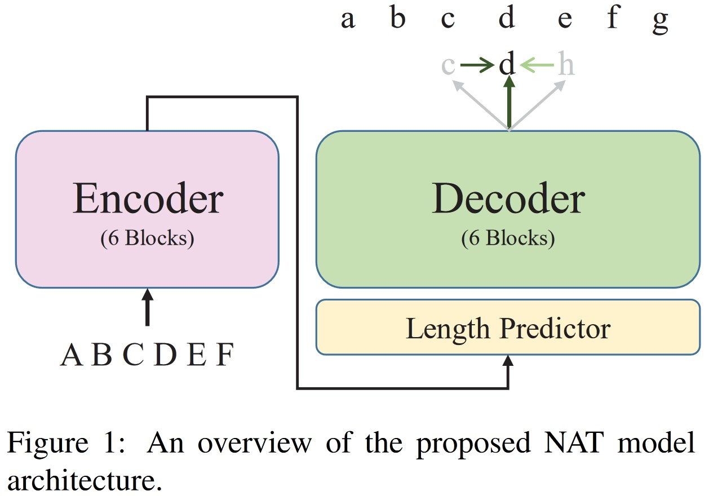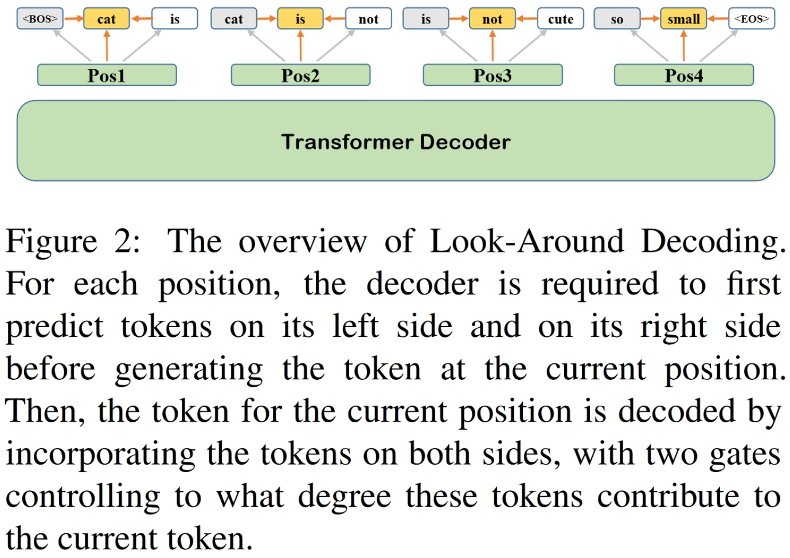 
 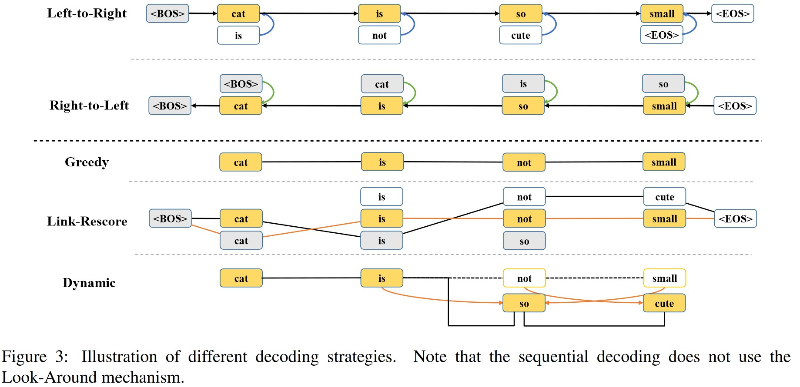 

3. **Blank Language Models** *EMNLP 2020* [[paper](https://arxiv.org/pdf/2002.03079.pdf) / [code](https://github.com/Varal7/blank_language_model)]
 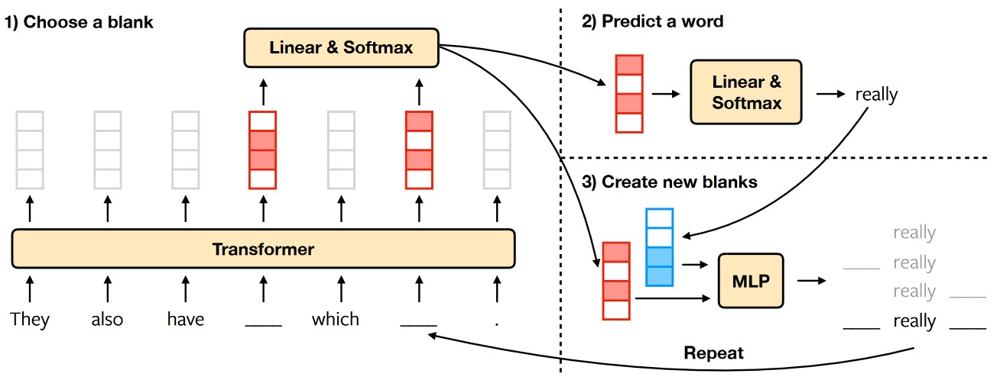 

4. **Spelling Error Correction with Soft-Masked BERT** *ACL 2020* [[paper](https://arxiv.org/pdf/2005.07421.pdf) / [code](https://blog.csdn.net/qq_35128926/article/details/106770581)]

5. **Exploiting Structured Knowledge in Text via Graph-Guided Representation Learning (GLM)** *arxiv2020*
  
 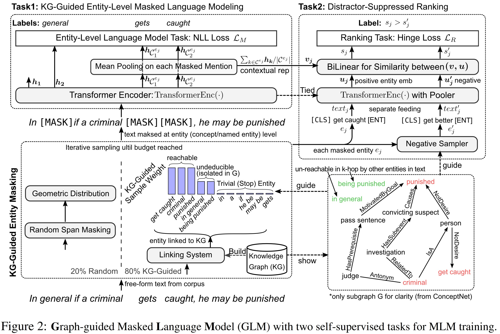 

### `Weak supervisory signal or Marker`

1. **Matching the Blanks: Distributional Similarity for Relation Learning** *ACL2019* [[paper](https://arxiv.org/pdf/1906.03158v1.pdf)]
   

2. **MarkedBERT: Integrating Traditional IR Cues in Pre-trainedLanguage Models for Passage Retrieval** *SIGIR2020* [[paper](https://arxiv.org/pdf/1906.03158v1.pdf) / [code](https://github.com/BOUALILILila/markers_bert)]
  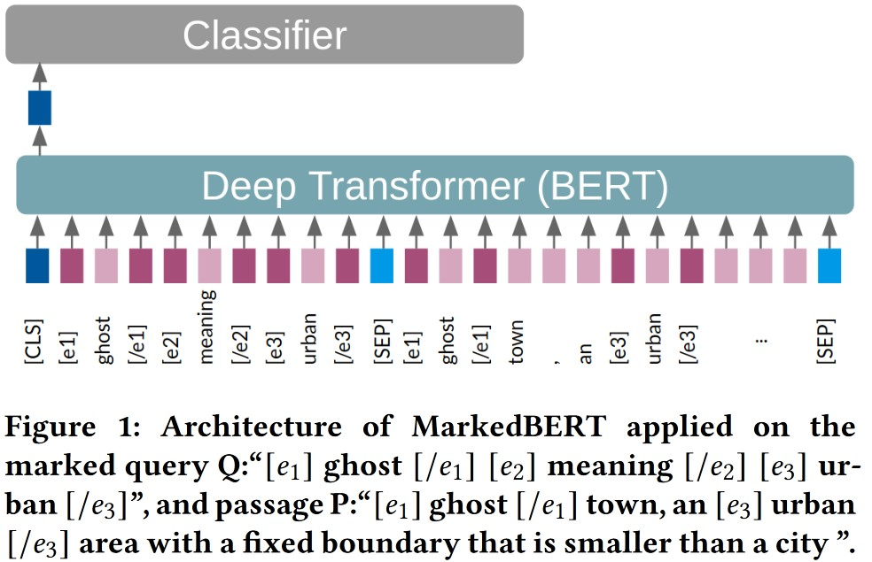 
 
3. **GlossBERT: BERT for Word Sense Disambiguation with Gloss Knowledge** *ENMLP2019* [[paper](https://arxiv.org/pdf/1908.07245.pdf) / [code](https://github.com/HSLCY/GlossBERT)]
  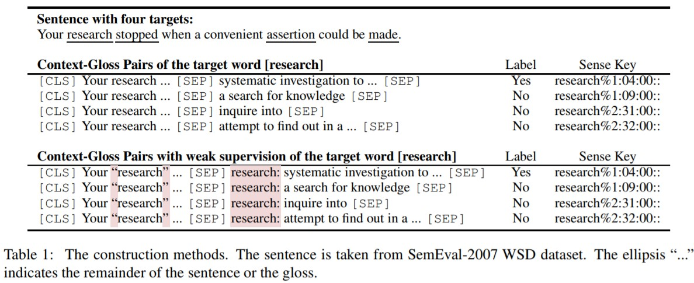 
 
4.**Enriching Pre-trained Language Model with Entity Information for Relation Classification** *arxiv2019* [[paper](https://arxiv.org/pdf/1905.08284.pdf)]
  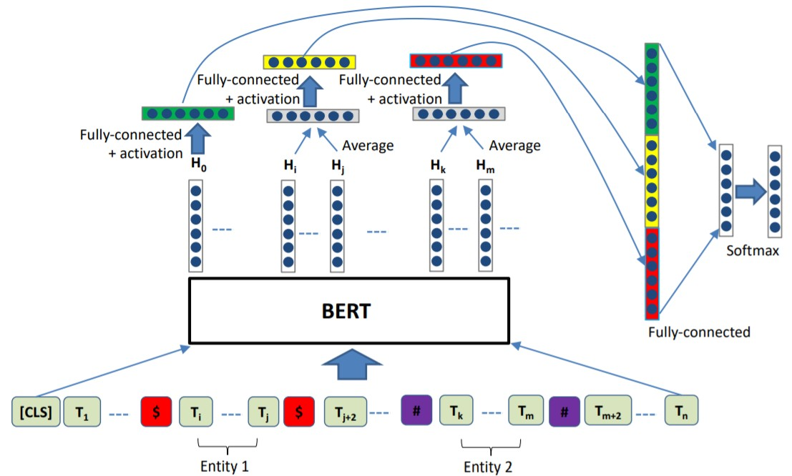 
 
5. **A Frustratingly Easy Approach for Joint Entity and Relation Extraction** *arxiv2020* [[paper](https://arxiv.org/pdf/2010.12812.pdf)]
  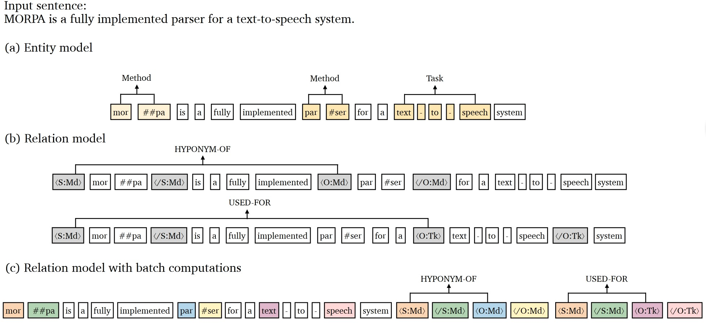 
 
 ### `Code Learning`
 1. **Improving Question Answering over Incomplete KBs with Knowledge-Aware Reader** *ACL2019* [[paper](https://arxiv.org/abs/1905.07098) / [code](https://github.com/xwhan/Knowledge-Aware-Reader)]
  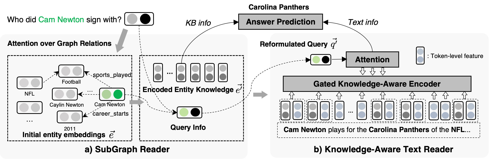 
 2. **Knowledge Enhanced Contextual Word Representations(KnowBERT)** *EMNLP2019* [[paper](https://arxiv.org/abs/1909.04164) / [code](https://github.com/allenai/kb)]
   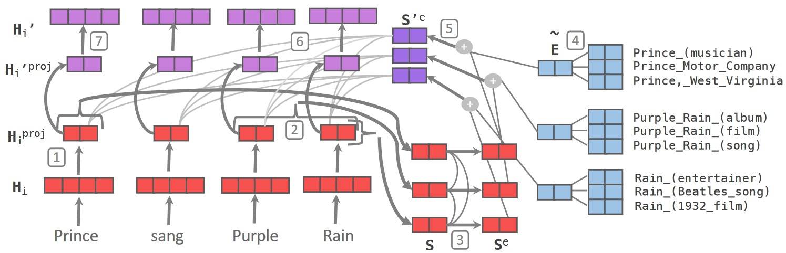 
  
 ### `Knowledge or Entity Linker`
 1. [self-supervised entity linker #19](https://github.com/allenai/kb/issues/19)
 2. **Scalable Zero-shot Entity Linking with Dense Entity Retrieval** *EMNLP2019* [[paper](https://arxiv.org/abs/1909.04164) / [code](https://github.com/facebookresearch/BLINK/tree/master/blink)]
   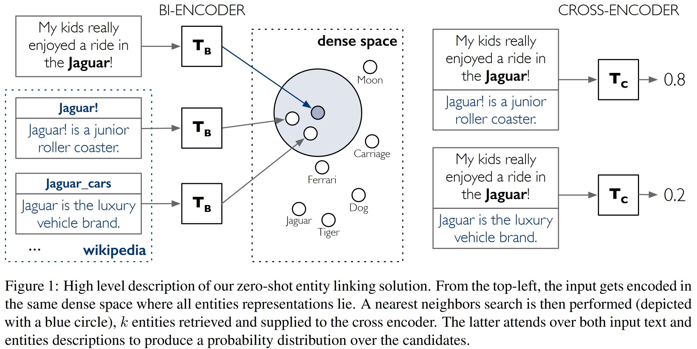 
 3. **Evaluating the Impact of Knowledge Graph Context on Entity Disambiguation Models** *CIKM2020* [[paper](https://arxiv.org/pdf/2008.05190.pdf) / [code](https://github.com/mulangonando/Impact-of-KG-Context-on-ED)]
     

## [Retieval-Papers](#content) 
1. **Sentence-BERT: Sentence Embeddings using Siamese BERT-Networks** *EMNLP 2019* [[paper](https://arxiv.org/pdf/1911.03814.pdf) / [code](https://github.com/UKPLab/sentence-transformers)]
 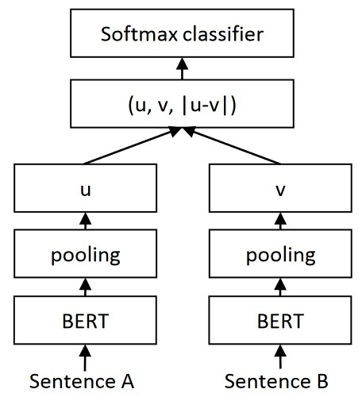 

2. **DC-BERT: Decoupling Question and Document for Efficient Contextual Encoding** *SIGIR2020* [[paper](https://arxiv.org/pdf/2002.12591.pdf)]
 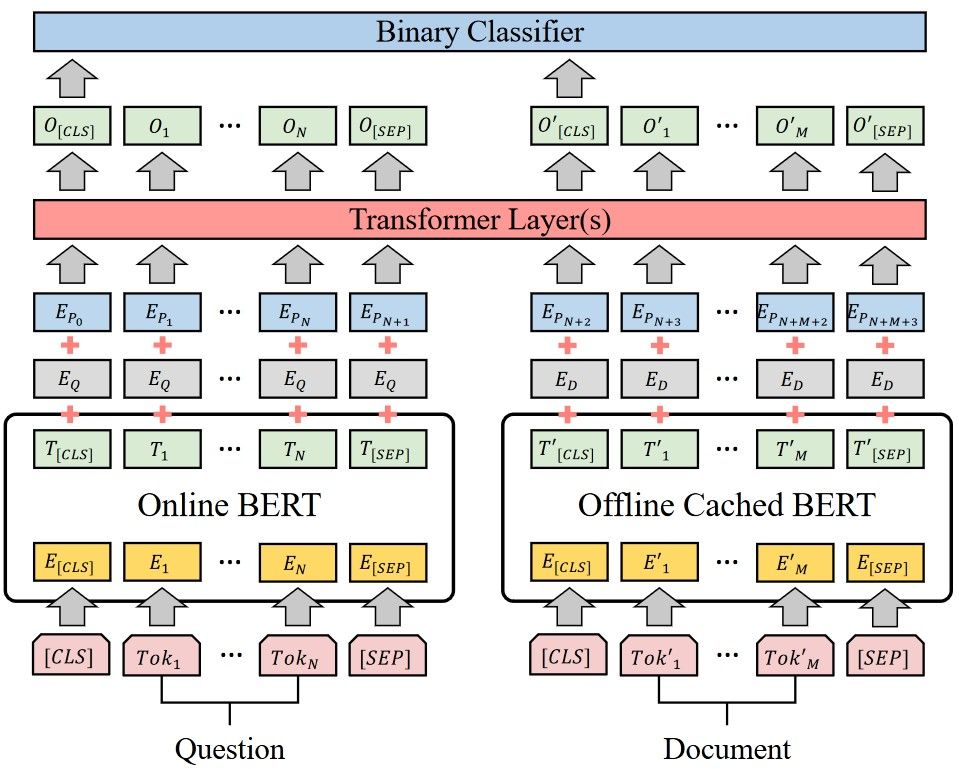 

3. **REALM: Retrieval-Augmented Language Model Pre Training** *arXiv2020* [[paper](https://arxiv.org/abs/2002.08909)]
 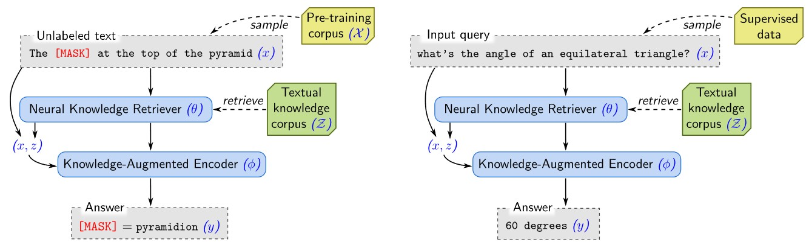 
 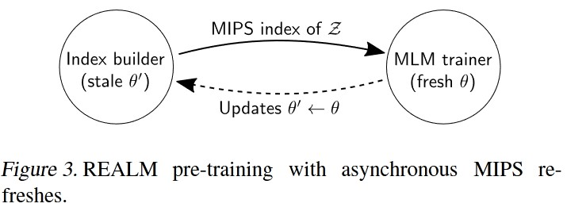 

4. **Zero-Shot Entity Linking with Dense Entity Retrieval** *arXiv2020* [[paper](https://arxiv.org/abs/1911.03814v2)]

5. **Dense Passage Retrieval for Open-Domain Question Answering** *ACL2020* [[paper](https://arxiv.org/pdf/2004.04906.pdf) / [code](https://fburl.com/qa-dpr)]
- DPR(Dense Passage Retriever) 稠密文章检索

      训练 由于原始的BERT预训练模型很通用，而且得到的句向量是不具备相似性计算要求的，也就是说，相似的两句话输入BERT得到的两个向量并不一定很近。因此，本论文基于Natural Questions (NQ)，TriviaQA (Trivia)，WebQuestions (WQ)，CuratedTREC (TREC)，SQuAD v1.1等数据集重新训练了一个BERT，专门用来生成问题段落的句向量表示。
  
- 数据构造

  **负样本构造方法：**
  
      Random：从语料中随机抽取；
      BM25：使用BM25检索的不包含答案的段落；
      Gold：训练集中其他问题的答案段落
  
  **正样本构造方法：**
  
        因为数据集如TREC, WebQuestions 和 TriviaQA中只包含问题和答案，没有段落文本，因此，论文通过BM25算法，在Wikipedia中进行检索，取top-100的段落，如果答案没有在里面，则丢掉这个问题。对于  SQuAD 和 NQ数据集，同样使用问题在Wikipedia检索，如果检索到的正样本段落能够在数据集中匹配则留下，否则丢掉。

6. **Latent Retrieval for Weakly Supervised Open domain Question Answering** *ACL2019* [[paper](https://arxiv.org/pdf/1906.00300.pdf)]
 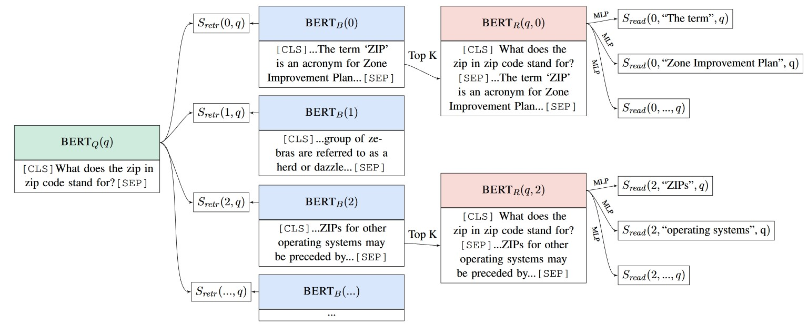 

7. **Learning to Learn from Weak Supervision by Full Supervision** *ICML 2018* [[paper](http://metalearning.ml/2017/papers/metalearn17_dehghani.pdf)]
 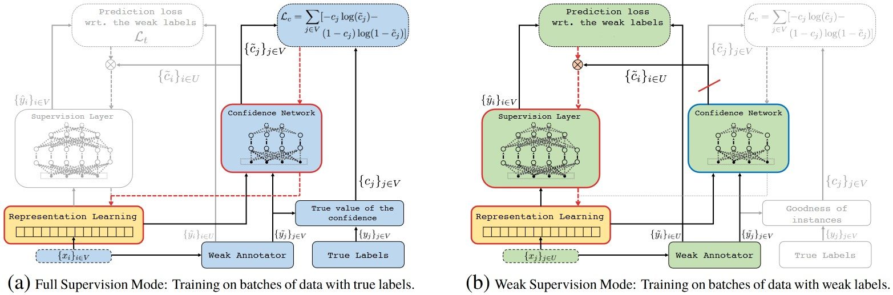 
8. **Selective Weak Supervision for Neural Information Retrieval** *WWW 2020* [[paper](https://arxiv.org/abs/2001.10382)]

9. **ColBERT: Efficient and Effective Passage Search via Contextualized Late Interaction over BERT** *SIGIR 2020* [[paper](https://arxiv.org/pdf/2004.12832.pdf)]
 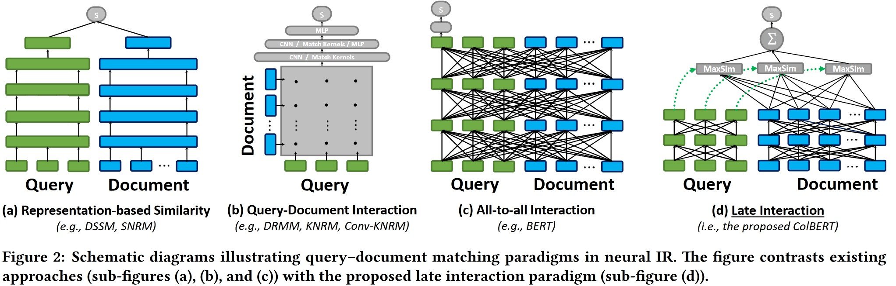 

10. **Poly-encoders:architectures and pre-trainingstrategies for fast and accurate multi-sentence scoring** *ICLR 2020* [[paper](https://arxiv.org/pdf/1906.00300.pdf)]
 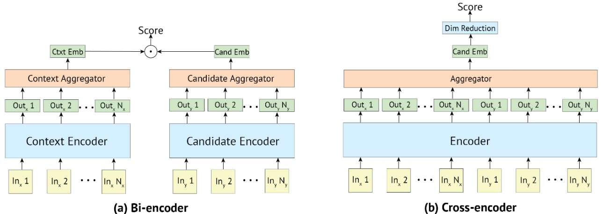 
 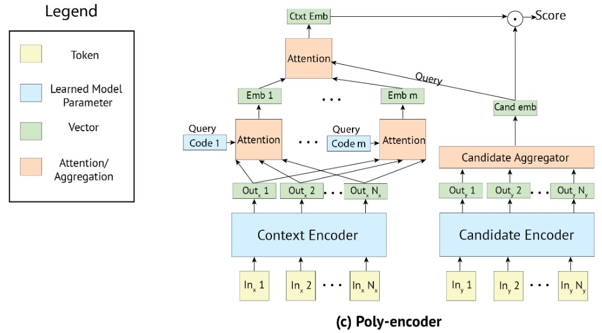 

## [Related papers](#content)
### `Model Fine-tune`
1. **Fine-Tuning Pretrained Language Models:Weight Initializations, Data Orders, and Early Stopping** *arxiv 2020* [[paper](https://arxiv.org/abs/2002.06305)]

2. **Show Your Work: Improved Reporting of Experimental Results** *EMNLP 2019* [[paper](https://arxiv.org/pdf/1909.03004.pdf) / [code](https://github.com/allenai/allentune)]

3. **Showing Your Work Doesn’t Always Work** *ACL 2020* [[paper](https://arxiv.org/pdf/2004.13705.pdf) / [code](https://github.com/castorini/meanmax)]

### `Multi-task Training`
1. **How to Fine-Tune BERT for Text Classification?** *CCL 2019* [[paper](https://arxiv.org/abs/1905.05583) / [code](https://github.com/xuyige/BERT4doc-Classification) / [post](https://zhuanlan.zhihu.com/p/109143667?from_voters_page=true)]

       All the tasks share the BERT layers and the em-bedding layer.  The only layer that does not shareis the final classification layer, which means thateach task has a private classifier layer.

## [Competitions](#competitions)

### `Entity Linking`
1. **CCKS2020 任务二：面向中文短文本的实体链指**
[官方链接](http://sigkg.cn/ccks2020/?page_id=516)
[任务书](http://sigkg.cn/ccks2020/wp-content/uploads/2020/05/2-CCKS2020%E6%8A%80%E6%9C%AF%E8%AF%84%E6%B5%8B-%E9%9D%A2%E5%90%91%E4%B8%AD%E6%96%87%E7%9F%AD%E6%96%87%E6%9C%AC%E7%9A%84%E5%AE%9E%E4%BD%93%E9%93%BE%E6%8C%87.docx)
[biendata](https://www.biendata.xyz/competition/ccks_2020_el/)
[Baseline](https://github.com/PaddlePaddle/Research/tree/master/KG/DuEL_Baseline)

## [Others](#content)
1. [XLink](https://github.com/solitaryzero/XLink)
2. [OpenMatch](https://github.com/thunlp/OpenMatch)
3. [NeuIRPapers](https://github.com/thunlp/NeuIRPapers)
4. [碎碎念：Transformer的细枝末节](https://zhuanlan.zhihu.com/p/60821628)
5. [BERT模型可以使用无监督的方法做文本相似度任务吗？](https://www.zhihu.com/question/354129879)
6. [Different deterministic behavior between CPU and CUDA for orthogonal initialization](https://github.com/pytorch/pytorch/issues/19013)
7. [知识图谱 | 实体链接](https://zhuanlan.zhihu.com/p/81073607)
8. [论文笔记 | 实体链接：问题、技术和解决方案](https://zhuanlan.zhihu.com/p/82302101)
9. [检索式多轮问答系统模型总结](https://zhuanlan.zhihu.com/p/46366940)
10. [BERT在小米NLP业务中的实战探索](https://blog.csdn.net/weixin_42137700/article/details/105817884)
 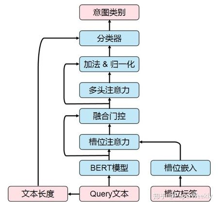 
11. [融合知识的检索模型汇总（持续更新）](https://zhuanlan.zhihu.com/p/110371338)
12. [NLP数据增强方法总结：EDA、BT、MixMatch、UDA](https://blog.csdn.net/xixiaoyaoww/article/details/104688002)
13. [BERT meet Knowledge Graph：预训练模型与知识图谱相结合的研究进展](https://zhuanlan.zhihu.com/p/270009212)
